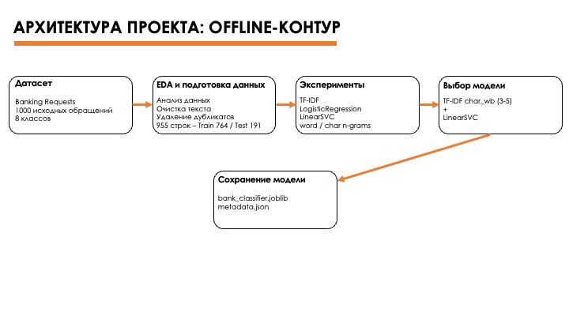
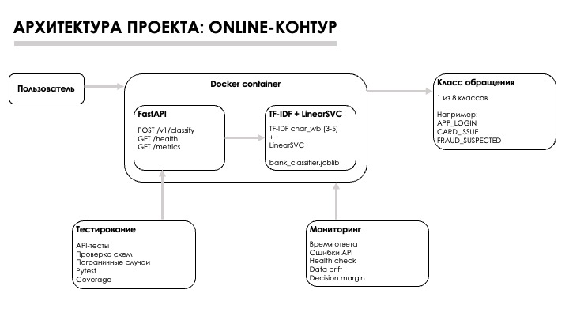

# Классификация обращений клиентов банка

Учебный ML-проект по автоматической классификации текстовых обращений клиентов банка в службу поддержки.

Система получает текст обращения пользователя и определяет одну из восьми категорий проблемы.

Проект строится как полный ML-пайплайн: от анализа и подготовки данных до выбора модели, API-сервиса, тестирования, контейнеризации и мониторинга.

## Задача

**Вход:** текст обращения клиента банка.

**Выход:** один из 8 классов:

| Класс | Описание |
|---|---|
| `PAYMENT_OUT_FAIL` | Проблемы с исходящими платежами |
| `INCOMING_DELAY` | Задержка входящего перевода |
| `APP_LOGIN` | Проблемы со входом в приложение |
| `APP_TECH` | Технические проблемы приложения |
| `FRAUD_SUSPECTED` | Подозрение на мошеннические операции |
| `CARD_ISSUE` | Проблемы с банковской картой |
| `ACCOUNT_SEIZED` | Ограничения или блокировка счёта |
| `KYC_VERIFICATION` | Проблемы с идентификацией и верификацией клиента |

## Данные

В проекте используется датасет `Banking Requests` с короткими русскоязычными обращениями клиентов банка.

Исходный датасет содержит:

- 1000 обращений;
- 8 классов;
- поля `ID`, `text` и `label`; для моделирования используются `text` и `label`;
- небольшой дисбаланс классов.

Перед обучением модели была выполнена базовая подготовка данных:

- удалены лишние пробелы;
- удалены дубликаты текстов;
- сохранён исходный текст без лемматизации и стемминга;
- не удалялись стоп-слова, пунктуация и цифры.

После удаления дубликатов осталось **955 обращений**.

Данные были разделены на обучающую и тестовую выборки со стратификацией по классам:

- Train: **764 обращения**;
- Test: **191 обращение**;
- соотношение: **80 / 20**.

Тестовая выборка не использовалась при выборе модели и подборе конфигурации.

## Эксперименты и выбор модели

Для выбора финальной модели было проведено несколько экспериментов с различными вариантами TF-IDF и классификаторов.

Для сравнения использовалась 5-fold cross-validation. Основная метрика — `Macro F1`, поскольку она учитывает качество классификации по всем классам.

| Эксперимент | Признаки | Модель | CV Macro F1 |
|---|---|---|---:|
| Baseline | TF-IDF word | LogisticRegression | 0.9043 |
| Experiment 1 | TF-IDF word + n-grams | LogisticRegression | 0.9042 |
| Experiment 2 | TF-IDF word + n-grams | LinearSVC | 0.9311 |
| Experiment 3 | TF-IDF `char_wb`, n-grams 3–5 | LinearSVC | **0.9505** |

Лучший результат показала комбинация:

- TF-IDF по символьным n-граммам `char_wb`;
- диапазон n-грамм: 3–5;
- классификатор `LinearSVC`.

Эта конфигурация была выбрана как финальная модель проекта.

При дополнительной проверке было обнаружено одно пересечение между train и test после нормализации текста. Этот пример был исключён из основной финальной оценки, поэтому итоговые метрики рассчитаны на 190 тестовых обращениях.

На тестовой выборке финальная модель показала:

- Accuracy: **0.9474**;
- Macro Precision: **0.9509**;
- Macro Recall: **0.9431**;
- Macro F1: **0.9450**.

Финальный ML-пайплайн сохранён в файле:

`models/bank_classifier.joblib`

Дополнительная информация о модели и окружении сохраняется в:

`models/metadata.json`

## Архитектура

Архитектура проекта разделена на два контура:

- **Offline-контур** — анализ и подготовка данных, эксперименты, выбор и сохранение модели.
- **Online-контур** — получение нового обращения через API, выполнение классификации и возврат результата пользователю.

### Offline-контур



В offline-контуре исходный датасет проходит этапы анализа и подготовки данных. После этого проводится серия экспериментов с различными вариантами TF-IDF и классификаторов.

По результатам cross-validation выбирается финальная конфигурация `TF-IDF char_wb (3–5) + LinearSVC`, которая сохраняется в виде готового ML-пайплайна `bank_classifier.joblib`.

### Online-контур



В online-контуре пользователь передаёт текст обращения в FastAPI-сервис. Сервис валидирует входные данные и передаёт текст финальному ML-пайплайну.

Модель возвращает один из восьми классов обращения.

FastAPI и ML-модель предполагается запускать внутри Docker-контейнера. Отдельные компоненты проекта отвечают за тестирование и мониторинг работы сервиса.

## Мониторинг

Для проекта разработан план мониторинга технического состояния сервиса, входных данных и поведения модели.

Контролируются следующие группы показателей.

### Технические метрики

- количество запросов;
- время ответа API;
- доля HTTP-ошибок;
- состояние `/health`.

### Входные данные

Контролируются:

- средняя длина текста;
- доля пустых обращений;
- доля текстов необычной длины;
- изменение характеристик входных данных относительно reference-выборки.

Для демонстрации data drift была создана искусственно изменённая выборка. Средняя длина текста увеличилась более чем на 200%, а доля текстов необычной длины достигла 100%, что привело к статусу `ALERT`.

### Поведение модели

Для финальной модели `LinearSVC` отсутствует метод `predict_proba`, поэтому для мониторинга неоднозначных предсказаний используется `decision margin`.

`Decision margin` рассчитывается как разница между двумя наибольшими значениями `decision_function`.

На тестовой выборке получены следующие значения:

- средний decision margin: **1.163**;
- медианный decision margin: **1.238**;
- доля прогнозов с `decision_margin < 0.35`: **8.90%**.

Для учебного проекта установлен начальный порог алерта:

- доля прогнозов с малым decision margin > **20%**;
- изменение доли отдельного класса относительно reference > **10 процентных пунктов**.

На тестовой выборке максимальное изменение доли класса составило **1.83 процентного пункта**, поэтому по выбранным метрикам существенных отклонений не обнаружено.

Подробная реализация мониторинга находится в:

`02_monitoring.ipynb`

## Структура проекта

```text
integ_ai_in_dev_nlp/
├── data/
│   ├── raw/
│   │   └── banking_requests.csv
│   └── processed/
│       ├── train.csv
│       └── test.csv
│
├── notebooks/
│   ├── 01_eda_preprocessing_baseline.ipynb
│   └── 02_experiments_selection_saving.ipynb
│
├── models/
│   ├── bank_classifier.joblib
│   ├── vectorizer.joblib
│   ├── classifier.joblib
│   └── metadata.json
│
├── reports/
│   └── experiments/
│       ├── experiments.csv
│       ├── fold_metrics.csv
│       ├── test_metrics.json
│       ├── classification_report.json
│       ├── confusion_matrix.csv
│       ├── confusion_matrix.png
│       ├── cv_comparison.png
│       ├── model_selection.md
│       └── ...
│
├── docs/
│   ├── architecture/
│   │   ├── architecture_offline.jpg
│   │   └── architecture_online.jpg
│   └── monitoring.md
│
├── api/
│   ├── app/
│   ├── Dockerfile
│   └── requirements.txt
│
├── 02_monitoring.ipynb
├── train_model.py
├── predict.py
├── requirements-experiments.txt
└── README.md
```

## Ограничения проекта

Проект является учебным прототипом и имеет ряд ограничений.

- Датасет синтетический и содержит относительно небольшое количество примеров — 955 обращений после очистки.
- Модель обучалась на коротких русскоязычных банковских обращениях и не проверялась на реальном production-трафике.
- Поддерживаются только 8 заранее заданных классов. Обращения, не относящиеся ни к одному из них, всё равно будут отнесены моделью к одному из существующих классов.
- `LinearSVC` не возвращает вероятности классов через `predict_proba`. Для анализа неоднозначных предсказаний используется `decision margin`, который не является вероятностью.
- Пороги мониторинга являются начальными и должны уточняться после накопления реальных данных.
- Автоматическое переобучение модели при обнаружении drift не реализовано.
- В проекте не реализован полный production-контур мониторинга с внешними системами визуализации и оповещения. Вместо этого подготовлена логика метрик, проверок и условий алертов.


