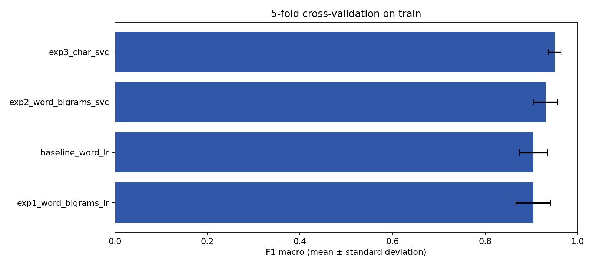
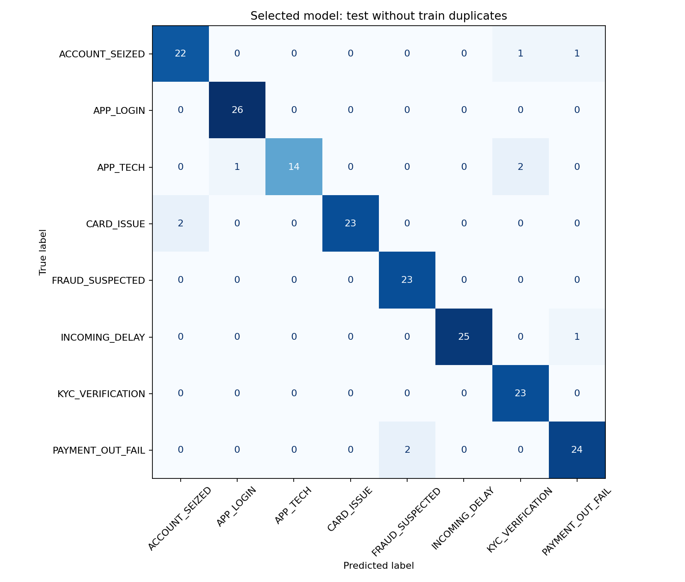

# Эксперименты, выбор и сохранение модели

Исходный репозиторий: https://github.com/yasinnsbts/integ_ai_in_dev_nlp, commit `12d4c9e1cb42384d6b46e8110d819add4bfd9eac`.
Задача: по тексту обращения выбрать одну из 8 категорий банковской поддержки.

## Протокол и данные

Использованы готовые CSV команды: train — 764, test — 191. Исходные файлы не изменены.
После приведения к нижнему регистру и удаления лишних пробелов обнаружены 2 повтора внутри train и 1 строка test, совпадающая с train.
TF-IDF сам приводит текст к нижнему регистру, поэтому такие совпадения существенны.
Для сравнения используется StratifiedGroupKFold: 5 общих для всех моделей folds, seed=42; одинаковые нормализованные тексты всегда в одном fold.
TF-IDF обучается только на обучающей части каждого fold, внутри Pipeline. Метки test не используются для выбора модели или параметров.
Основной критерий — средний F1-macro; при точном равенстве выбирается меньший std, затем имя модели. Std рассчитан с ddof=0 и не является доверительным интервалом.
В ноутбуке команды baseline получал F1-macro ≈0.912 при обычном StratifiedKFold. Ниже baseline пересчитан на групповых folds, поэтому его нельзя напрямую сравнивать со старым числом.

## Задача 4. Три эксперимента и контрольный baseline

| Вариант | Признаки TF-IDF | Классификатор | Проверяемое изменение |
|---|---|---|---|
| baseline_word_lr | Отдельные слова | LogisticRegression, C=1 | Контрольный уровень из проекта |
| exp1_word_bigrams_lr | Слова и пары соседних слов | LogisticRegression, C=1 | Добавление контекста относительно baseline |
| exp2_word_bigrams_svc | Слова и пары соседних слов | LinearSVC, C=1 | Смена классификатора относительно эксперимента 1 |
| exp3_char_svc | char_wb, фрагменты 3–5 символов | LinearSVC, C=1 | Смена признаков относительно эксперимента 2 |

Символьные признаки могут учитывать общие части русских слов и опечатки. Это гипотеза о признаках; отдельного теста устойчивости к опечаткам здесь нет.
У всех TF-IDF остальные параметры стандартные; у LR max_iter=1000, у SVC max_iter=5000; seed=42.

| Вариант | Accuracy | Precision macro | Recall macro | F1 macro ± std | Среднее время fit, с |
|---|---:|---:|---:|---:|---:|
| exp3_char_svc | 0.9529 | 0.9536 | 0.9496 | 0.9505 ± 0.0138 | 0.163 |
| exp2_word_bigrams_svc | 0.9332 | 0.9398 | 0.9290 | 0.9311 ± 0.0261 | 0.073 |
| baseline_word_lr | 0.9070 | 0.9165 | 0.9017 | 0.9043 ± 0.0305 | 0.118 |
| exp1_word_bigrams_lr | 0.9083 | 0.9183 | 0.9012 | 0.9042 ± 0.0374 | 0.157 |

## Задача 5. Выбор модели

Выбран `exp3_char_svc`: наибольший средний F1-macro на общей кросс-валидации — 0.9505. Изменение относительно пересчитанного baseline: +4.62 процентного пункта.
Macro-усреднение даёт каждой категории одинаковый вес. Это полезно, в частности, для менее многочисленного APP_TECH.
На OOF-прогнозах train F1 класса APP_TECH: baseline 0.8382, выбранная модель 0.8794; recall: 0.7703 → 0.8378.
OOF-метрики по объединённым прогнозам могут немного отличаться от среднего метрик по folds. Разница CV сама по себе не доказывает статистическую значимость.
Выбранная модель затем обучена на всех строках train. Test не добавлялся к обучению.

### Финальная проверка выбранной модели

| Выборка | N | Accuracy | Precision macro | Recall macro | F1 macro |
|---|---:|---:|---:|---:|---:|
| Основная: test без совпадений с train | 190 | 0.9474 | 0.9509 | 0.9431 | 0.9450 |
| Исходный test целиком, для сопоставимости | 191 | 0.9476 | 0.9509 | 0.9443 | 0.9457 |

Обе строки рассчитаны из одного набора прогнозов одной выбранной модели; это не дополнительный подбор по test.

| Класс | Precision | Recall | F1 | Количество |
|---|---:|---:|---:|---:|
| ACCOUNT_SEIZED | 0.9167 | 0.9167 | 0.9167 | 24 |
| APP_LOGIN | 0.9630 | 1.0000 | 0.9811 | 26 |
| APP_TECH | 1.0000 | 0.8235 | 0.9032 | 17 |
| CARD_ISSUE | 1.0000 | 0.9200 | 0.9583 | 25 |
| FRAUD_SUSPECTED | 0.9200 | 1.0000 | 0.9583 | 23 |
| INCOMING_DELAY | 1.0000 | 0.9615 | 0.9804 | 26 |
| KYC_VERIFICATION | 0.8846 | 1.0000 | 0.9388 | 23 |
| PAYMENT_OUT_FAIL | 0.9231 | 0.9231 | 0.9231 | 26 |

Ошибочные обращения перечислены в test_errors.csv; все прогнозы — в test_predictions.csv.

## Задача 6. Сохранение и обратная загрузка

Сохранены models/bank_classifier.joblib (весь Pipeline), models/vectorizer.joblib и models/classifier.joblib (отдельные компоненты), а также models/metadata.json с версиями, параметрами, метриками и SHA-256.
После joblib.load прогнозы всего Pipeline и отдельно vectorizer + classifier совпали с исходными на всех 191 строках test.
Для новых обращений достаточно model.predict([text]); повторный fit/fit_transform не нужен.
LinearSVC не выдаёт вероятности через predict_proba. Его decision_function нельзя называть вероятностью без отдельной калибровки.

## Ограничения

Это оценка на небольшом учебном датасете. Происхождение и лицензия исходных обращений в просмотренных файлах проекта не описаны. Есть похожие формулировки; группировка по регистру и пробелам не устраняет все перефразировки и возможные шаблонные повторы.
Высокие метрики не гарантируют такое же качество на реальных обращениях. Категории вне этих восьми, несколько тем в одном обращении и автоматическое направление в банковские очереди здесь не реализованы.
Результаты test не использовались для изменения кандидатов. Повторный запуск на тех же файлах проверяет воспроизводимость, но не является новой независимой оценкой.

## Воспроизведение

Установить requirements-experiments.txt и выполнить python train_model.py либо Run All в новом ноутбуке. Время fit зависит от компьютера.
Среда этого прогона: Python 3.13.13, scikit-learn 1.8.0, pandas 2.2.3, numpy 2.3.5, scipy 1.17.0, joblib 1.5.3.
